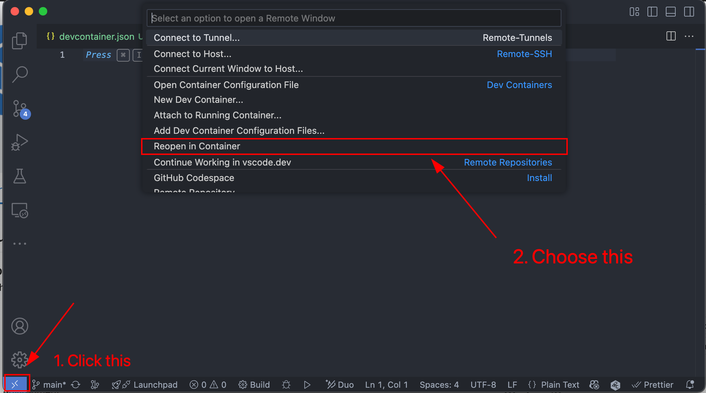
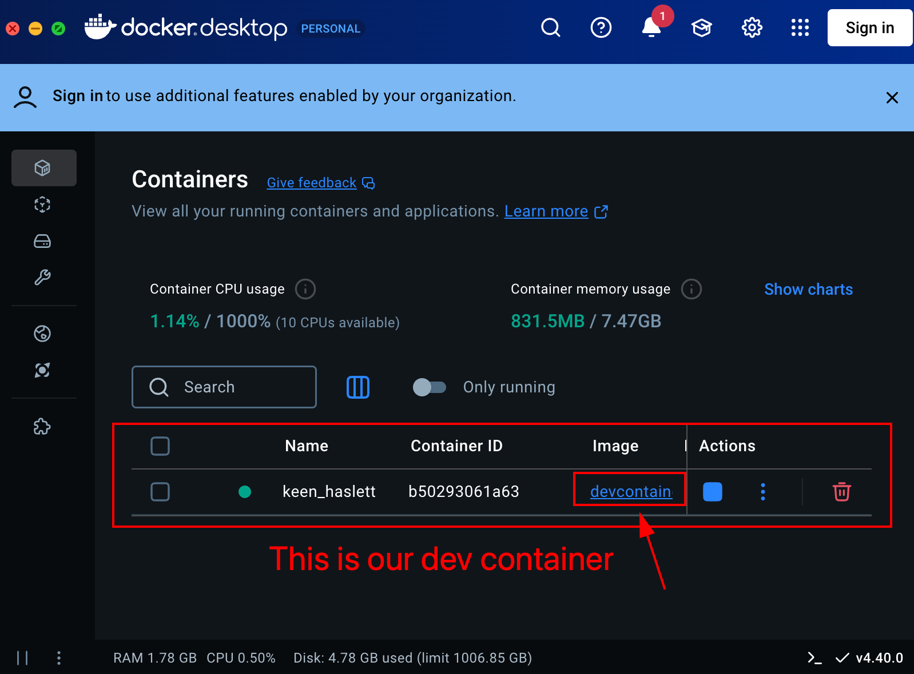
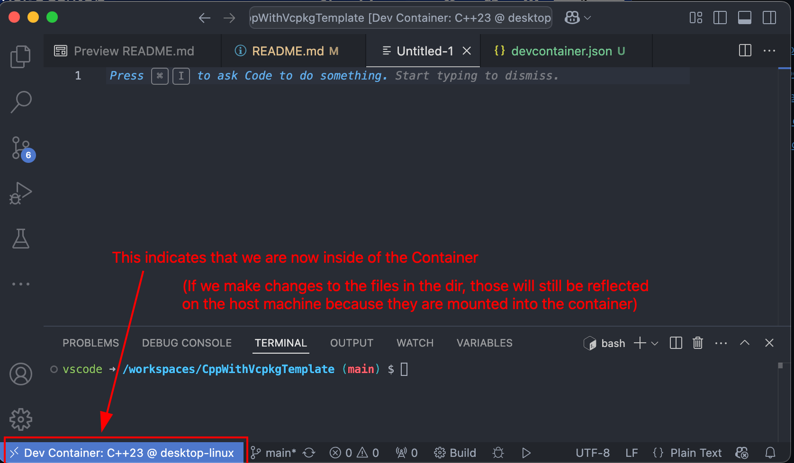
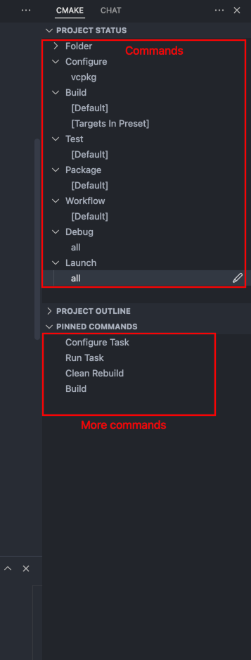
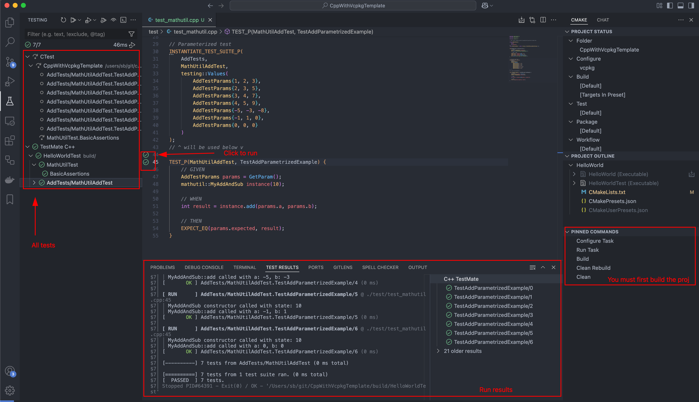
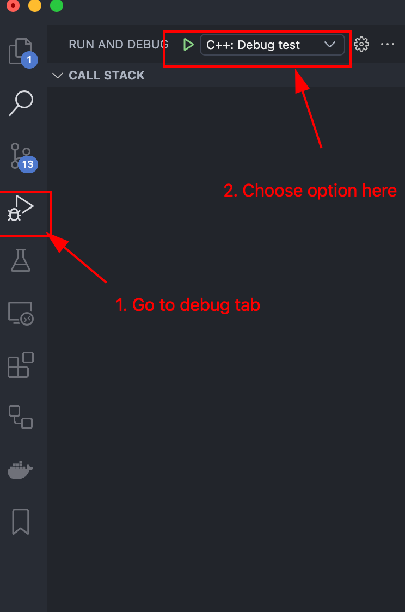
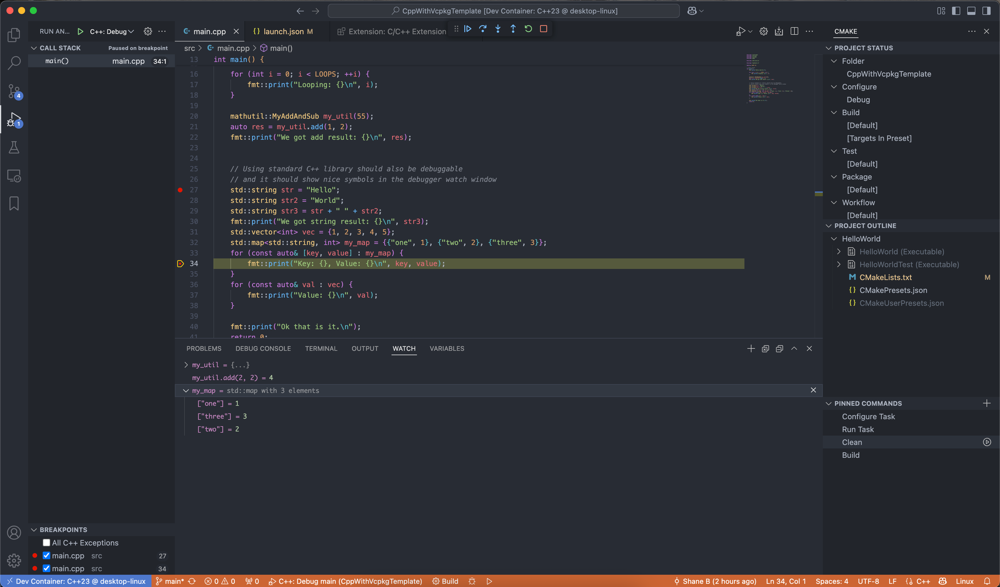

# C++23 Template Project using VCPKG + Cheatsheet

Simple sample project/template project using Microsoft's [vcpkg](https://vcpkg.io/en/) and a Visual Studio Code setup. This README includes a cheatsheet for expanding upon the project.

Hopefully easy to copy-paste from. If anybody except myself runs across this, feel free to clone this and copy from it or use it as a basis for your project or whatever.

I made this because getting this set up was very annoying unlike more popular languages like Java or python and nodejs these days.

### 📑 Table of Contents

- [C++23 Template Project using VCPKG + Cheatsheet](#c23-template-project-using-vcpkg--cheatsheet)
    - [📑 Table of Contents](#-table-of-contents)
    - [ℹ️ What is this](#ℹ️-what-is-this)
    - [🧩 How to expand on this](#-how-to-expand-on-this)
  - [🛠️ Setup](#️-setup)
    - [📋 Prerequisites](#-prerequisites)
      - [Mandatory](#mandatory)
      - [Optional: VSCode](#optional-vscode)
      - [Optional: VSCode with Docker + Dev Containers Extension](#optional-vscode-with-docker--dev-containers-extension)
      - [Dependencies + Setup](#dependencies--setup)
      - [Setup CMake Tools to use `vcpkg`](#setup-cmake-tools-to-use-vcpkg)
  - [🔨 Building](#-building)
  - [🏃 Running](#-running)
  - [🧪 Testing](#-testing)
    - [Via CLI](#via-cli)
    - [From VSCode UI](#from-vscode-ui)
  - [🔴 Debugging](#-debugging)


### ℹ️ What is this

A C++23 "HelloWorld" Setup Template:

- MacOS/Linux support (via `brew`), technically Windows should be supportable too (am too lazy to add atm)
- [VSCode Dev Containers](https://marketplace.visualstudio.com/items?itemName=ms-vscode-remote.remote-containers) Support - hence also support for MacOS/Linux/Windows via Docker
    - Prerequisite: [Docker Desktop](https://www.docker.com/products/docker-desktop/)
- Package/dependency management via [`vcpkg`](https://vcpkg.io/en/), with dependencies:
    - `main` project using [`fmt`](https://vcpkg.io/en/package/fmt) library
    - `test` project using [`GoogleTest`](https://vcpkg.io/en/package/gtest) library
- Setup steps `README` for VSCode and CLI (you're reading it right now 😄)
- Unit test setup using GoogleTest
- CLI and Editor support (VSCode)
- UI/IDE integration via VSCode: compiling & testing & debugging

The style of this setup is probably very java-esque as I have been doing a lot of modern Java lately...

<details>
<summary><b>ℹ️ Background Info</b></summary>

> **For the initiated** (java people): you can think of this as those templates that you can get in [IntelliJ](https://www.jetbrains.com/idea/)
> when you are creating a new project.
>
> They set up the entire java directory structure, `/test` and `/main`
> folders, a `Main` class with a "Hello World" function, a Test class with unit testing framework [JUnit](https://junit.org/junit5/) and a sample test, a maven `pom.xml` ([dependencies management](https://mvnrepository.com/) via the [maven](https://maven.apache.org/) cli tool) with your specified Java Language Level (e.g. `21`), etc.
> The idea is that anybody can clone a repo set up like that, and so long as they have java installed, they can immediately get set up with it
> and debug everything. Dependencies are also centrally managed via maven and locked in place by version -- retrieving dependencies is standardised into maven. Finding dependencies is easy via the `maven` package browser.
>
> It basically gives you a template that is very easy to add stuff on top of, saving you the hassle of setting up that entire structure from scratch.
>
> I want to have something like this but for C++, hence this repo.
</details>


<details>
<summary><b>ℹ️ Overview of Supported Setups</b></summary>

- MacOS
  - MacOS native ✅
  - MacOS + [Docker](https://www.docker.com/products/docker-desktop/) + [Dev Containers Extension](https://marketplace.visualstudio.com/items?itemName=ms-vscode-remote.remote-containers) (isolated "local linux VM" on MacOS) ✅
- Linux
  - Linux native ✅
  - Linux + [Docker](https://www.docker.com/products/docker-desktop/) + [Dev Containers Extension](https://marketplace.visualstudio.com/items?itemName=ms-vscode-remote.remote-containers) (isolated "local linux VM") ✅
- Windows
  - Windows native ❓ (TODO: to be validated/updated here if it works)
  - Windows + [WSL](https://learn.microsoft.com/en-us/windows/wsl/) + [WSL Extension](https://marketplace.visualstudio.com/items?itemName=ms-vscode-remote.remote-wsl) ✅
  - Windows + [Docker](https://www.docker.com/products/docker-desktop/) + [Dev Containers Extension](https://marketplace.visualstudio.com/items?itemName=ms-vscode-remote.remote-containers) (isolated "local linux VM" on Windows) ✅
</details>

### 🧩 How to expand on this

Once everything has been set up (see below first)...

**Browse for available packages** here: [vcpkg.io/en/packages](https://vcpkg.io/en/packages?query=)


<details>
<summary><b>👉 How To: Adding a new <code>.cpp</code> file</b></summary>
<br>

Then it needs to be "registered" in `CMakeLists.txt`.

Suppose you add a file `./src/mynewfile.cpp`, then we add it to the main executable:

```makefile
add_executable(
    ${PROJECT_EXECUTABLE_NAME}
    src/main.cpp
    src/mathutil.cpp
    src/mynewfile.cpp # <- [NEW] needs to be added to the main executable
)
```

And to the test executable:
```makefile
add_executable(
    ${PROJECT_TEST_EXECUTABLE_NAME}
    src/mathutil.cpp
    src/mynewfile.cpp # <- [NEW] needs to be added to the test executable
    # test files:
    test/test_mathutil.cpp
    test/test_mynewfile.cpp # <- [NEW] (if you want to add unit tests for your new file)
)
```

If you are adding a new file, it's probably a good idea to add unit tests for your new logic.
So it is suggested to create a test file like `./tests/test_mynewfile.cpp` and add Unit Tests to
it, mirroring the existing tests (or going off of the GoogleTest docs).

</details>

<details>
<summary><b>👉 How To: Add a package/library</b></summary>
<br>

Suppose you want to add [gtest](https://github.com/google/googletest) (the idea is equivalent for other packages/libraries that are available in `vcpkg`):

1\. Add it to `vcpkg.json`
```sh
vcpkg add port gtest
```

2\. Add it as a dependency/requirement in `CMakeLists.txt`:
```makefile
find_package(gtest CONFIG REQUIRED)
```

3\. Add additional entries to `CMakeLists.txt` (these are library-specific).
For example using [Quickstart CMake from GoogleTest](https://google.github.io/googletest/quickstart-cmake.html)

So, for this particular library, we need to also add all of this (which is mentioned in the library's docs):
```makefile
enable_testing()

target_link_libraries(
    ${PROJECT_TEST_EXECUTABLE_NAME}
    PRIVATE
    fmt::fmt
    GTest::gtest_main # <- From the GoogleTest docs
)
# GoogleTest extra
include(GoogleTest) # Mentioned in the docs: https://google.github.io/googletest/quickstart-cmake.html
gtest_discover_tests(${PROJECT_TEST_EXECUTABLE_NAME}) # ^
```

</details>


## 🛠️ Setup

### 📋 Prerequisites

#### Mandatory

Have some system package manager installed (i.e. not for code-level C++ libraries themselves).

<details>
<summary>More Info</summary>

The subsequent commands are based on [brew](https://brew.sh/) (available on MacOS/Linux).

The setup can probably be adapted to Windows, too. Possibly using [chocolatey](https://chocolatey.org/). Alternatively, just use VSCode as your editor (optionally + Docker) to run this under Linux (WSL), then you don't need to bother making this work in Windows. You have two options for this:
- [WSL](https://learn.microsoft.com/en-us/windows/wsl/) + [WSL Extension](https://marketplace.visualstudio.com/items?itemName=ms-vscode-remote.remote-wsl) and run via the extension as if you are natively developing on Linux from here
- [Docker](https://www.docker.com/products/docker-desktop/) + [Dev Containers Extension](https://marketplace.visualstudio.com/items?itemName=ms-vscode-remote.remote-containers) - more details on that below (Section: "[VSCode with Docker + Dev Containers Extension](#vscode-with-docker--dev-containers-extension)")
</details>


#### Optional: VSCode

[VSCode](https://code.visualstudio.com/download) as the main text editor/IDE, as there are nice IntelliJ-like UI Tools available for C++/CMake in VSCode (think of the `maven` and `gradle` support/sidebar in IntelliJ).

```sh
brew install --cask visual-studio-code
```

#### Optional: VSCode with Docker + Dev Containers Extension

Prerequisite: VSCode setup as above.

You don't have to use Docker or the Dev Containers Extension (this setup should work without).
However you can use it if you want a Linux dev experience outside of Linux.

<details>
<summary><b>🐳 How to: Dev Containers</b></summary>


You will have to install [Docker Desktop](https://www.docker.com/products/docker-desktop/). E.g. via `brew`:
```sh
brew install --cask docker
```

You will then install the [Dev Containers extension](https://marketplace.visualstudio.com/items?itemName=ms-vscode-remote.remote-containers) for vscode:

```sh
code --install-extension ms-vscode-remote.remote-containers
```

You then need to make sure that Docker Desktop is running. So open it and make sure it is running.

Once you have that installed and enabled, you can click this icon at the bottom-left of the VSCode window, and choose `Reopen in Container`:



This will create a new Docker container using the `image` defined in [`./.devcontainer/devcontainer.json`](./.devcontainer/devcontainer.json). And it will "reload" VSCode into the container:

|  Docker Desktop | VSCode |
| ---- | ---- |
|  |  |

The `Terminal` you get in this window will be that of the container.

You will likely be prompted to (re)install a bunch of extensions at this point, which you should do, because the extensions "inside of the Container" are different and separate from the extensions on your host machine.


You can then proceed to the next steps in this guide. The idea of the "Dev Container" is that it will stick around and get reused while you work on this project, working like a VM. So you can install whatever tools you want in it at whatever locations.

</details>

#### Dependencies + Setup

<details>
<summary><b>📦 Base Dependencies (via e.g. <code>brew</code>)</b></summary>
<br>

First, install [brew](https://brew.sh/) (MacOS/Linux) or equivalent.


Then, install C++ build tools:

```sh
brew update

# C++ build tools
brew install llvm
brew install cmake
brew install ninja
brew install pkg-config
```

</details>

<details>
<summary><b>🧰 Package Manager - <code>vcpkg</code></b></summary>
<br>

This project uses [vcpkg](https://vcpkg.io/en/) for C++ package/dependency management.

Set it up (once per dev machine):
```sh
cd ~/git # or whatever directory you use for git
git clone https://github.com/microsoft/vcpkg.git
cd vcpkg && ./bootstrap-vcpkg.sh
```

To make the `vcpkg` package manager globally available (see also [docs](https://learn.microsoft.com/en-us/vcpkg/get_started/get-started-vscode?pivots=shell-bash#4---set-up-environment-variables)):
```sh
# Let us assume you cloned the repo above into ~/git/vcpkg
VCPKG_REPO_CLONE_PATH=$HOME/git/vcpkg

# Append to end of ~/.zshrc (MacOS)
echo "export VCPKG_ROOT=$VCPKG_REPO_CLONE_PATH" >> ~/.zshrc
echo "export PATH=\$PATH:\$VCPKG_ROOT" >> ~/.zshrc
source ~/.zshrc # after you've made changes

# Append to end of ~/.bashrc (Linux/MacOS)
echo "export VCPKG_ROOT=$VCPKG_REPO_CLONE_PATH" >> ~/.bashrc
echo "export PATH=\$PATH:\$VCPKG_ROOT" >> ~/.bashrc
source ~/.bashrc # after you've made changes

# Test that the package manager works:
vcpkg --version
```

👉 **Browse for available packages**: use [vcpkg.io/en/packages](https://vcpkg.io/en/packages?query=)

(see also [this guide](https://learn.microsoft.com/en-us/vcpkg/get_started/get-started-vscode?pivots=shell-bash) for setting it up).
</details>

<details>
<summary><b>🏗️ Build Automation - <code>CMake</code></b></summary>
<br>

The following setup is needed for Build Automation both via the CLI as well as via the VSCode UI.
See also the docs on the setup [here](https://learn.microsoft.com/en-us/vcpkg/get_started/get-started?pivots=shell-bash).

#### Setup CMake Tools to use `vcpkg`
To make the VSCode UI properly use the `vcpkg` executable,
update and add the following file with your path to the directory of the repo containing `vcpkg` (installed in the section above).

**[Option 1]** Automatically by running this command:

<details>
<summary>🍏 MacOS Command</summary>


```sh
# Let us assume you cloned the vcpkg repo into ~/git/vcpkg
VCPKG_REPO_CLONE_PATH=$HOME/git/vcpkg

cp ./CMakeUserPresets.json.example ./CMakeUserPresets.json
sed -i "" -e "s#<path to vcpkg>#$VCPKG_REPO_CLONE_PATH#g" ./CMakeUserPresets.json
```
</details>

<details>
<summary>🐧 Linux Command</summary>


```sh
# Let us assume you cloned the vcpkg repo into ~/git/vcpkg
VCPKG_REPO_CLONE_PATH=$HOME/git/vcpkg

cp ./CMakeUserPresets.json.example ./CMakeUserPresets.json
sed -i -e "s#<path to vcpkg>#$VCPKG_REPO_CLONE_PATH#g" ./CMakeUserPresets.json
```
</details>
<br>


**[Option 2]** Or manually:
1. Copy `./CMakeUserPresets.json.example` to `./CMakeUserPresets.json` (this file is ignored by git)
2. open `./CMakeUserPresets.json` and replace `<path to vcpkg>` with the absolute path to the directory containing the `vcpkg` executable.

</details>

<details>
<summary><b>📝 Editor + Build Automation Tools - <code>VSCode</code> (Optional)</b></summary>
<br>

It's not mandatory to use VSCode, but the project was set up around it.

First, install VSCode for your OS.
Next, install these extensions for working with C++ using VSCode:

```sh
code --install-extension ms-vscode.cpptools
code --install-extension ms-vscode.cpptools-extension-pack
code --install-extension ms-vscode.cmake-tools
code --install-extension vadimcn.vscode-lldb
code --install-extension hbenl.vscode-test-explorer
code --install-extension matepek.vscode-catch2-test-adapter
```

We will invoke Build Automation commands via the [CMake Tools extension](https://marketplace.visualstudio.com/items/?itemName=ms-vscode.cmake-tools). There's a few ways to do this (including strictly via the terminal but this would require additional setup).

This is very similar to e.g. `maven` for Java (think of `mvn clean compile`, `mvn test`, ...).

See also section "Building" below.

</details>

## 🔨 Building


<details>
<summary><b>Build via CLI + CMake</b></summary>
<br>

If you had existing build output, get rid of it:
```sh
rm -rf build
```

To build, we run:
```sh
mkdir build
# Runs the setup configured in CMakeUserPresets.json with { "name": "default", ... }
cmake --preset=Debug # or: Release
# Actually compiles the project
cmake --build build
```

(See also [docs here](https://learn.microsoft.com/en-us/vcpkg/get_started/get-started?pivots=shell-bash#4---build-and-run-the-project))
</details>

<details>
<summary><b>Build via VSCode + CMake</b></summary>
<br>

We invoke Build Automation commands via the [CMake Tools extension](https://marketplace.visualstudio.com/items/?itemName=ms-vscode.cmake-tools).

There's a few ways to do this (including strictly via the terminal but this would require additional setup).

This is very similar to e.g. `maven` for Java (think of `mvn clean compile`, `mvn test`, ...).

TL;DR (choose one):


<details>
<summary><b>a) Use VSCode Commands UI (⭐️ Recommended)</b></summary>
<br>

You can run the build steps via the UI, similar to how this works e.g. in IntelliJ for Java.

This is recommended due to it's convenience, but you can use whatever setup.

- Use the "`CMake`" tab in the left sidebar of VSCode (should have gotten added by default when you installed the [CMake Tools extension](https://marketplace.visualstudio.com/items/?itemName=ms-vscode.cmake-tools))
- If you want, you can move this extension's UI to the right sidebar by click-dragging to the right on the screen
- Use `Project Status` window and use `Pinned Commands` to pin useful commands like `Clean Rebuild` and `Build`
- You can execute commands by clicking on them in this UI



</details>

<details>
<summary><b>b) Use VSCode Run Command (MacOS) </b></summary>
<br>

You can also run the Build steps via the "Run" bar:

- Invoke the `Run` bar in VSCode via `⌘ (Cmd)` +`⇧ (Shift)` + `P`
- Run CMake commands specific commands by typing `CMake: <Your Action>` in the `Run` bar (because the `Run` bar contains a bunch of stuff from VSCode and form your other extensions too)

</details>


<details>
<summary><b>c) Others: TODO add equivalent setups/commands</b></summary>
<br>

TODO...

It would basically come down to equivalent or the same commands, except you use `CTRL` in place of MacOs `Cmd`.

But to be validated/updated.

(Note from author: I'm actually mainly a Linux user, but learning to use MacOS during this project)

</details>
</details>

## 🏃 Running

After the project has been compiled/built, it is available as a binary in the `./build` output directory.

You can execute it like so:
```sh
./build/HelloWorld
```

Sample output should look like this:

```
Hello World!
Looping: 0
Looping: 1
Looping: 2
Looping: 3
Looping: 4
Looping: 5
Looping: 6
Looping: 7
Looping: 8
Looping: 9
MyAddAndSub constructor called with state: 55
MyAddAndSub::add called with a: 1, b: 2
We got add result: 3
Ok that is it.
```


## 🧪 Testing

On Build, the test project also gets built.

You can run the tests:

### Via CLI

First, clean and build the project (see above). Then:

```sh
cd build
ctest
```

Sample output should look like this:
```
Test project /Users/sb/git/CppWithVcpkgTemplate/build
    Start 1: MathUtilTest.BasicAssertions
1/1 Test #1: MathUtilTest.BasicAssertions .....   Passed    0.01 sec

100% tests passed, 0 tests failed out of 1

Total Test time (real) =   0.01 sec
```

### From VSCode UI

Use the standard `Testing` tab in the UI after (`Clean`ing and) `Build`ing
the project using the CMake integration:

<details>
<summary>What this looks like in the UI</summary>
<br>


</details>

## 🔴 Debugging

<details>
<summary>You can interactively debug via the VSCode UI</summary>
<br>

1. Go to the `Run and Debug` tab
2. Set breakpoints in your files by clicking in the left margin and placing red dots, as usual
3. Choose a debug configuration
    1. Use `C++: Debug main` as the debug dropdown option to debug [`main.cpp`](./src/main.cpp)
    2. Use `C++: Debug test` as the debug dropdown option to debug the Unit Tests
4. When debugging Unit Tests, you can also:
    - Right-Click the icon next to a testcase and choose the "`Debug`" option there, to limit the debugging to that Unit Test
    - Right-Click tests in the Testing list and choose "`Debug`" there

<details>
<summary>👁️ Debug Tab Overview</summary>


</details>

<details>
<summary>🐧 Debugging Example Linux (Dev Containers)</summary>


</details>
</details>